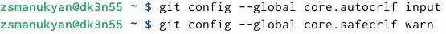
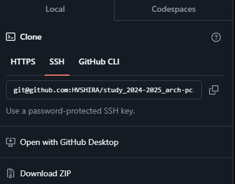

---
## Front matter
title: "Лабораторная работа №2 "

author: "Манукян Захар НБИбд-03-24"

## Generic otions
lang: ru-RU
toc-title: "Содержание"

## Bibliography
bibliography: bib/cite.bib
csl: pandoc/csl/gost-r-7-0-5-2008-numeric.csl

## Pdf output format
toc: true # Table of contents
toc-depth: 2
lof: true # List of figures
lot: true # List of tables
fontsize: 12pt
linestretch: 1.5
papersize: a4
documentclass: scrreprt
## I18n polyglossia
polyglossia-lang:
  name: russian
  options:
	- spelling=modern
	- babelshorthands=true
polyglossia-otherlangs:
  name: english
## I18n babel
babel-lang: russian
babel-otherlangs: english
## Fonts
mainfont: IBM Plex Serif
romanfont: IBM Plex Serif
sansfont: IBM Plex Sans
monofont: IBM Plex Mono
mathfont: STIX Two Math
mainfontoptions: Ligatures=Common,Ligatures=TeX,Scale=0.94
romanfontoptions: Ligatures=Common,Ligatures=TeX,Scale=0.94
sansfontoptions: Ligatures=Common,Ligatures=TeX,Scale=MatchLowercase,Scale=0.94
monofontoptions: Scale=MatchLowercase,Scale=0.94,FakeStretch=0.9
mathfontoptions:
## Biblatex
biblatex: true
biblio-style: "gost-numeric"
biblatexoptions:
  - parentracker=true
  - backend=biber
  - hyperref=auto
  - language=auto
  - autolang=other*
  - citestyle=gost-numeric
## Pandoc-crossref LaTeX customization
figureTitle: "Рис."
tableTitle: "Таблица"
listingTitle: "Листинг"
lofTitle: "Список иллюстраций"
lotTitle: "Список таблиц"
lolTitle: "Листинги"
## Misc options
indent: true
header-includes:
  - \usepackage{indentfirst}
  - \usepackage{float} # keep figures where there are in the text
  - \floatplacement{figure}{H} # keep figures where there are in the text
---

# Цель работы

Целью работы является изучить идеологию и применение средств контроля версий. Приобрести практические навыки по работе с системой git. 

# Выполнение лабораторной работы

1. Базовая настройка git 

Сначала сделаю предварительную конфигурацию git. Открываю терминал и ввожу следующие команды, указав имя и email владельца репозитория: (рис. 1) (рис. [-@fig:001]).

{#fig:001 width=70%}

Настраиваю utf-8 в выводе сообщений git (рис. 2)

{#fig:002 width=70%}

Задаю имя начальной ветки (будем называть ее master) (рис. 3)

{#fig:003 width=70%}

Ввожу параметр autocrlf и параметр safecrlf (рис. 4)

{#fig:004 width=70%}

2. Создание SSH ключа 

Для последующей идентификации пользователя на сервере репозиториев необходимо сгенерировать пару ключей (приватный и открытый). (рис. 5 и рис. 6)

{#fig:005 width=70%}

{#fig:006 width=70%}

После генерации ключа, загружаю открытый ключ, скопировав из локальной консоли в буфер обмена. Вставляю ключ в появившееся на сайте поле и указываю для ключа имя (Title).(рис. 7)

{#fig:007 width=70%}

3. Сознание рабочего пространства и репозитория курса на основе шаблона 

Открываю терминал и создаю каталог для предмета «Архитектура компьютеров». (рис. 8)

{#fig:008 width=70%}

Задаю имя репозитория и создаю репозиторий (рис. 9)

{#fig:009 width=70%}

Открываю терминал  и захожу  в каталог курса.  Клонирую созданный репозиторий. (рис. 10)

{#fig:010 width=70%}

4. Настройка каталога курса 

Перехожу в каталог курса.

{#fig:011 width=70%}

Удаляю лишние файлы и создаю необходимые каталоги.

{#fig:012 width=70%}

Отправляю файлы на сервер 

{#fig:013 width=70%}

{#fig:014 width=70%}

Проверяю правильность создания иерархии рабочего пространства в локальном репозитории и на странице github.

{#fig:015 width=70%}

# Выводы

Я изучил идеологию и применение средств контроля версий, и приобрел практические навыки по работе с системой git
